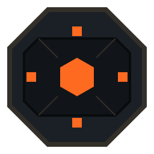

<p align="center">
  
</p>

# Sentinel

<p align="center"><strong>Defensive telemetry for EVE Frontier turret operators.</strong></p>

---

Sentinel is an EVE Frontier dashboard for tracking turret assemblies, their indexed event history, network-node assignments, and related operator metadata. The project combines a React dashboard, a Bun/Express support API, and a Rust indexer that follows turret activity on Sui.

The product direction is intentional:

- brutalist but polished UI
- honest, explicit state handling
- EVE Frontier language over generic admin-app wording
- fluid interactions that still feel sharp and tactical

## What It Covers

- turret assembly discovery from Sui-owned objects
- event history and threat intelligence from indexed turret events
- network-node assignment and retained solar-system mapping workflows
- live operator view plus a fixture-backed `/demo` route for review and development
- world-aware behavior for current development on `Utopia` with `Stillness` as the production target

## Tech Stack

- `Bun` workspaces for the monorepo, scripts, and API runtime
- `React 19` and `Vite` for the dashboard
- `TypeScript` across the dashboard, API, and shared contracts
- `Tailwind CSS v4` for styling
- `Express 5` and `pg` for dashboard support APIs
- `Rust` with `tokio`, `reqwest`, `tokio-postgres`, and `diesel` for the Sui indexer
- `PostgreSQL` for indexed events, node mappings, and derived dashboard state
- `Podman Compose` for the preferred local development stack
- `Vitest`, Testing Library, Playwright, ESLint, and Prettier for validation

## Repository Layout

```text
.
|-- apps/
|   |-- dashboard/      # React dashboard UI
|   |-- api/            # Bun + Express support API
|   `-- indexer/        # Rust indexer for Sui turret events
|-- packages/
|   `-- shared-types/   # Shared GraphQL queries and TypeScript contracts
|-- docs/               # Product, domain, design system, ADRs
|-- specs/              # Speckit specs, plans, tasks, quickstarts
|-- assets/             # Shared branding assets
|-- docker-compose.dev.yml
`-- docker-compose.yml
```

## Getting Started

### Prerequisites

- `Podman` and `podman compose`
- `Bun` 1.2+ for host-native workflows
- `Rust` and `cargo` if you want to run the indexer outside containers

### Preferred Local Workflow

The repo is designed to be iterated on with the development stack:

```bash
podman compose -f docker-compose.dev.yml up
```

Local services:

- dashboard: `http://127.0.0.1:5173`
- api: `http://127.0.0.1:3002`
- postgres: `127.0.0.1:5433`

Useful routes:

- live dashboard: `http://127.0.0.1:5173`
- demo dashboard: `http://127.0.0.1:5173/demo`

Use the live dashboard when you want the real wallet-connected flow. Use `/demo` when you want a fixture-backed review surface without depending on live telemetry.

Notes:

- use `Podman`, not Docker, for documented workflows in this repository
- the dev stack defaults to the current `Utopia` world assumptions
- the demo route stays fixture-backed on purpose; it does not pretend to be live telemetry
- some older repo quickstarts still mention `5174`, but the checked-in dashboard runtime is currently configured for `5173`

### Production-Style Stack

For a production-style container build, use the main compose file:

```bash
podman compose up --build
```

### Host-Native Workflow

If you want to run pieces directly on your machine instead of through Podman:

```bash
bun install
bun run dev
cargo run --manifest-path apps/indexer/Cargo.toml
```

The root `dev` script starts the dashboard and API together. The indexer runs separately.

## Validation

For dashboard-focused work, start with:

```bash
bun lint
bunx vitest run --environment jsdom
```

For the full repo:

```bash
bun test
```

For indexer-only work:

```bash
cargo test --manifest-path apps/indexer/Cargo.toml
```

## Documentation

- [CONTRIBUTING.md](./CONTRIBUTING.md) for contribution rules and commit expectations
- [CHANGELOG.md](./CHANGELOG.md) for notable project changes
- Design and spec documentation is located in the `./docs` directory.

## License

This project is licensed under the [MIT License](./LICENSE.md).
